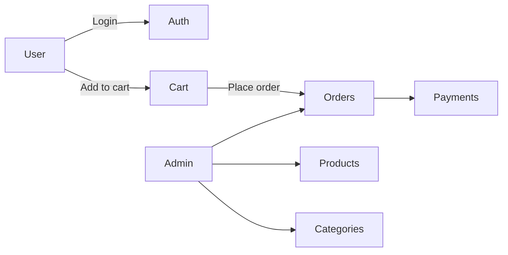

# **E-Commerce Backend Overview**

This document explains the **structure, functionality, and flow** of the e-commerce backend.

---

## **1️⃣ File Structure**

```
ecommerce-backend/
├── database.js           # SQLite database connection & table creation
├── ecommerce.db          # SQLite database file
├── server.js             # Entry point: mounts routes, starts server
├── package.json          # Node.js project info & dependencies
├── package-lock.json     # Dependency lock file
├── node_modules/         # Installed Node modules
├── utils/                # Utility functions
│   └── auth.js           # JWT authentication & role-based access
├── models/               # Database interaction logic
│   ├── userModel.js
│   ├── productModel.js
│   ├── categoryModel.js
│   ├── cartModel.js
│   ├── orderModel.js
│   └── paymentModel.js
└── routes/               # Express routes (API endpoints)
    ├── users.js
    ├── products.js
    ├── categories.js
    ├── cartRoutes.js
    ├── orderRoutes.js
    └── adminRoutes.js
```

---

## **2️⃣ Responsibilities**

| File / Folder     | Purpose                                                                                               |
| ----------------- | ----------------------------------------------------------------------------------------------------- |
| **server.js**     | Mounts routes, enables JSON parsing and CORS, starts the server.                                      |
| **database.js**   | Connects to SQLite, defines tables: Users, Products, Categories, Cart, Orders, Order_Items, Payments. |
| **utils/auth.js** | JWT token generation, verification, role-based access, password hashing.                              |
| **models/**       | Database operations for each entity: Users, Products, Categories, Cart, Orders, Payments.             |
| **routes/**       | Express endpoints, modular for user, admin, cart, orders, products, categories.                       |

---

## **3️⃣ Route Overview**

### **User Routes**

* `/users` → Register/login users, fetch profile, role-based access.

### **Product Routes**

* `/products` → List all products, get product details.

### **Category Routes**

* `/categories` → List categories, get category details.

### **Cart Routes**

* `/cart` → View, add, update, remove, clear cart items.

### **Order Routes**

* `/orders` → Place orders, view user orders, get order details.

### **Admin Routes**

* `/admin/products` → Add/update/delete products, manage stock.
* `/admin/categories` → Add/update/delete categories.
* `/admin/orders` → View all orders.

---

## **4️⃣ Data Flow Overview**

```
User (Frontend)
  └─> /users/login → verifyToken → req.user

User adds items → /cart/add → cartModel → Cart table

User places order → /orders/place
  ├─> Fetch cart items → Cart table
  ├─> Create order → Orders table
  ├─> Insert order items → Order_Items table
  ├─> Create payment → Payments table
  └─> Clear cart → Cart table

Admin routes → /api/admin
  ├─> Manage products → Products table
  ├─> Manage categories → Categories table
  └─> View all orders → Orders + Order_Items + Users
```

---

## **5️⃣ Security & Access**

* **JWT Authentication:** Protects all routes.
* **Role-based Authorization:**

  * `admin` → full access (products, categories, orders)
  * `staff` → partial access if implemented
  * `user` → access only to own cart/orders
* **Passwords hashed** with bcrypt before storing.
* Payments can be **simulated** (pending/completed) for presentation.
* **Note:** JWT secret is currently hardcoded for demo purposes. No `.env` required.

---

## **6️⃣ Interaction Flow**

```
Frontend → Express Routes → Models → SQLite Database

Example: Placing an order
POST /orders/place
  └─> orderRoutes.js
      ├─> orderModel.js
      ├─> paymentModel.js
      └─> cartModel.js
          └─> database.js → SQLite tables
```

* **Routes** handle request/response
* **Models** handle database logic
* **Utils** handle authentication/security

---

## **7️⃣ Team Setup Instructions**

1. **Clone the repository**

   ```bash
   git clone <repo-url>
   cd ecommerce-backend
   ```

2. **Install dependencies**

   ```bash
   npm install
   ```

3. **Start the server**

   ```bash
   node server.js
   ```

   * Default port: `3000`
   * If port 3000 is busy, server falls back to `5000`.

4. **Database**

   * SQLite file `ecommerce.db` is included.
   * Tables are initialized automatically via `database.js`.

5. **No .env required for demo/presentation**

   * JWT secret is hardcoded (`utils/auth.js`).
   * Passwords are hashed via bcrypt.

6. **Testing API endpoints**

   * Use Postman or browser for GET requests.
   * Example: `GET http://localhost:3000/products`

7. **Workflow**

   * User: register → login → add to cart → place order
   * Admin: manage products/categories → view all orders

---

## **8️⃣ Optional Mermaid Diagram**




